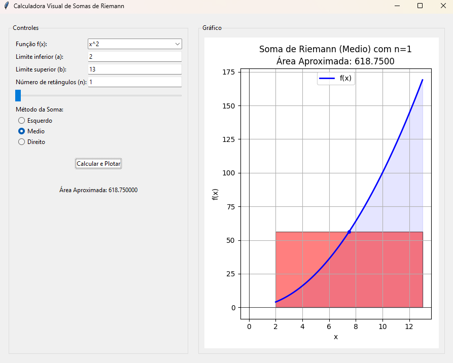

# Calculadora Visual Interativa de Somas de Riemann

## Descrição
Este projeto é uma aplicação desktop desenvolvida em Python que permite aos usuários visualizar e entender o conceito de integral definida através da aproximação por Somas de Riemann. A ferramenta é interativa e educacional, demonstrando como a área sob uma curva é calculada e como a precisão da aproximação é afetada pelo número de retângulos e pelo método de soma utilizado.

Este software foi desenvolvido como parte do Trabalho Colaborativo para as disciplinas de Cálculo 2.

## Funcionalidades Principais
* Seleção de funções matemáticas pré-definidas.
* Entrada de limites de integração (a, b).
* Definição do número de retângulos (n) através de campo de texto ou slider interativo.
* Seleção do método da Soma de Riemann: Esquerdo, Direito ou Ponto Médio.
* Visualização gráfica dinâmica da função, dos retângulos de aproximação e da área calculada.
* Atualização em tempo real do gráfico e da área aproximada ao alterar os parâmetros.

## Visualização do Aplicativo
)

## Tecnologias Utilizadas
* **Linguagem:** Python 3.x
* **Interface Gráfica (GUI):** Tkinter
* **Plotagem Gráfica:** Matplotlib
* **Cálculos Numéricos:** NumPy

## Pré-requisitos
* Python 3 instalado.
* As bibliotecas Matplotlib e NumPy.

## Instalação das Dependências
Para instalar as bibliotecas necessárias, abra o terminal ou prompt de comando e execute:
```
pip install matplotlib numpy
```

Como Usar
Clone ou baixe este repositório.
Navegue até a pasta raiz do projeto (calculadora_riemann/) pelo terminal.
Execute o arquivo app.py usando o Python:
```
python app.py
```
A interface gráfica da calculadora será iniciada.

Estrutura do Projeto
calculadora_riemann/
|
|-- app.py                      # Script principal: interface gráfica e lógica de eventos
|-- riemann_calculator.py       # Módulo para o cálculo da Soma de Riemann
|-- plotter.py                  # Módulo para gerar os gráficos com Matplotlib
|-- README.md                   # Este arquivo

Exemplo de Teste
Para verificar o funcionamento:

Função f(x): "x"
Limite inferior (a): 0
Limite superior (b): 2
Número de retângulos (n): 2
Resultados esperados para Área Aproximada:
Método Esquerdo: 1.0
Método Direito: 3.0
Método Médio: 2.0

Autores

Diogo Santos Cruz /
Kevyn Silva Rodrigues / 
Juend Berg da Silva / 
William Martins de Almeida / 
Victor Santos de Paula /
Jose Pessoa Laurentino / 
Erison Silva Oliveira
